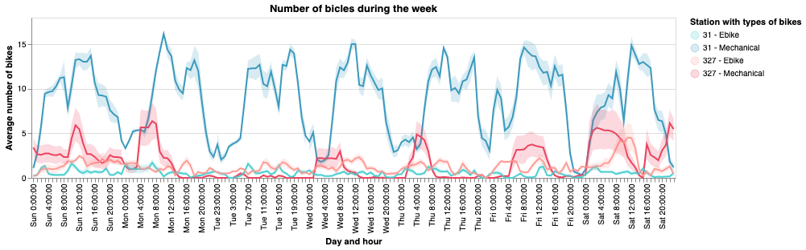

# Bicing Visualizations

The aim of this project was to develop two sets of insightful visualizations for the Bicing Data. Bicing is the Barcelona bike sharing service. Both groups of visualizations were developed with Python's library **Altair**.

The first visualization consisted of a static infographic, comparing the usage of two docking stations during January 2020. The infographic was designed to show the performance differences of two stations with opposite characteristics (one very busy by the sea and the other at the mountain, less frequented). 

  

The second visualization is a set of interactive plots, showing the performance of all Barcelona stations during January 2020. The aim of this more complex visualization was on one hand to show an "overview" of the whole Bicing service and on the other hand to allow the user access specific information under request.

This project was developed in the context of [VI -GCED](https://www.fib.upc.edu/en/studies/bachelors-degrees/bachelor-degree-data-science-and-engineering/curriculum/syllabus/VI-GCED) class, as a way to implement both theoretical and practical knowledge learnt during the course. All the visualizations were designed with a strong focus on technical quality principles such as *Schneiderman's mantra* and the *laws of perception*.

Both visualizations are implemented in Collab ipynb notebooks. In the notebooks all the design process, decisions and final result are detailed (in Catalan). Aside being post in this repository, they can also be found and used interactively with Collab at:

- [Project 1](https://colab.research.google.com/drive/1mMeYFNVQxyDsZV9LNxN2eE8JUq7yq9zM?usp=sharing) Static visualization
- [Project 2](https://drive.google.com/file/d/1R1Q7fNpseBFGVvt4iX9xWP8weW3kyOWc/view?usp=sharing) Interactive visualization

## Team

Developed by:

| [Patri Cabot](https://github.com/patricia-cabot) | [Marc Vernet](https://github.com/marcvernet31) |

Students at [UPC](https://www.upc.edu/ca).
